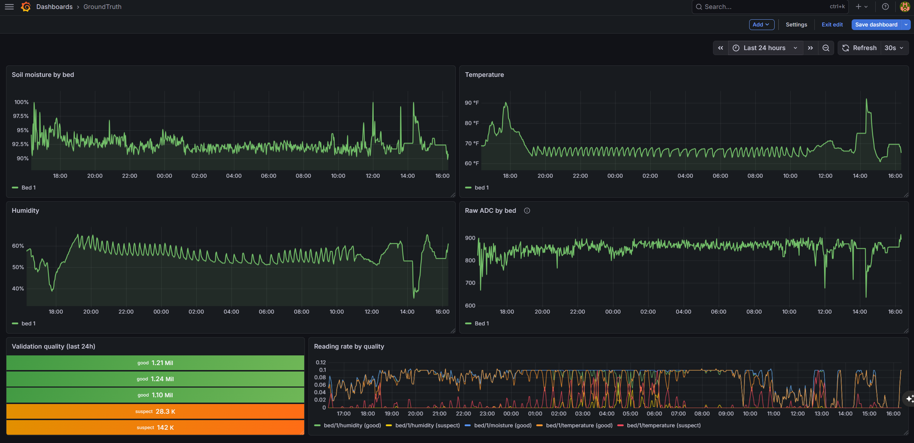

# GroundTruth

> **A two-tier validation framework for streaming numeric data, with a
> soil sensor IoT system as its reference implementation.** Real-time
> per-reading checks. Per-sensor health scoring over time. Three
> dashboards. Runs continuously on a Raspberry Pi watching a real plant.



---

## The story

GroundTruth started as an IoT garden monitor. The validator emerged as
the more interesting technical contribution somewhere around hour three.

Within hours of the first sensor coming online, the validation pipeline
had flagged **25,000 consecutive readings as suspect**. The sensor was
working. The values were "100% moisture" — and they were also wrong.

My calibration constants assumed the sensor reads ADC 1200 in wet soil.
Mine reads 750. Every reading was calibrating above 100%, clamping to
the upper bound, and the dashboard would have shown a flat line as
moisture data. The stuck-reading detector caught it: 25,000 identical
values is not a real sensor.

That moment made the validator more interesting than the IoT system that
hosts it. The IoT side is well-trodden — sensors, MQTT, time-series.
The validator is the thing that catches errors at the source, before
they pollute downstream analysis. It's the part of the project that
generalizes beyond gardening.

---

## What it is

GroundTruth is two things stacked:

**1. The validator** (the interesting part)
- A two-tier validation pipeline for streaming numeric data
- Tier-1: per-reading rules (range, raw plausibility, stuck detection, rate-of-change)
- Tier-2: per-sensor health scoring (quality rate, cadence, drift, variance, recency)
- Quality flags persisted alongside data so dashboards can filter or visualize broken sources
- Sensor health gauges exposed to Prometheus for ops-style alerting

**2. The IoT system** (the reference implementation)
- ESP32-C3 sensor nodes publishing soil moisture, temperature, humidity via MQTT
- Rust ingestion server (Axum + tokio + rumqttc) handling MQTT subscription and HTTP API
- SQLite persistence with quality flags inline on every row
- Three observability surfaces: Next.js dashboard, Grafana, raw JSON API
- Self-contained Docker Compose stack with bundled Prometheus
- Runs continuously on a Raspberry Pi 5 watching a real plant

---

## The validation pipeline

The validator is structurally separate from the IoT bits. The Rust
modules `src/validation.rs` and `src/sensor_health.rs` take numbers
with metadata (zone, zone_id, metric, value, raw_adc, timestamp) and
return quality judgments. They don't know anything about soil.

### Tier-1: per-reading validation

Every reading is assigned `quality ∈ {good, suspect, invalid}` plus a
human-readable `validation_reason` when not good. Invalid readings are
persisted (not dropped) so broken sensors remain diagnosable.

| Rule | What it catches | Severity |
|------|----------------|----------|
| Value range | Implausible values (e.g. moisture > 100%) | Invalid |
| Raw ADC range | ADC outside [100, 3995] — saturated/shorted sensor | Invalid |
| Stuck reading | 6+ consecutive readings within ±0.01 | Suspect |
| Rate of change | Implausibly rapid deltas (e.g. 30%+ moisture change in 10 min) | Suspect |

Severity precedence is `Invalid > Suspect > Good`.

### Tier-2: per-sensor health monitoring

While Tier-1 judges individual readings, Tier-2 judges sensor *streams*
over time. Each sensor gets a 0-100 health score updated every 30
seconds, combining five weighted signals:

| Signal | Weight | What it catches |
|--------|--------|-----------------|
| Quality rate | 35% | High suspect/invalid rates from Tier-1 |
| Reporting cadence | 25% | Sensor stopped reporting or fell behind expected frequency |
| Drift detection | 20% | Recent mean has moved >3σ from long-term baseline |
| Variance ratio | 10% | Recent stddev is outside 0.5x–2x the baseline stddev |
| Recency | 10% | Time since last good reading approaches 10 minutes |

Baselines are computed from the **last 7 days of good readings only**.
Excluding bad readings from the baseline prevents sensor degradation
from infecting the model used to detect that same degradation. A sensor
that's been broken for a week still has a clean baseline from the week
before.

The Tier-2 signals are designed around well-documented capacitive soil
sensor failure modes from the hobbyist embedded community: gradual
coating-leak drift over months (Cave Pearl Project, Daniel Robertson),
production variance between sensors from the same batch (arduinodiy),
and slow degradation patterns that escape per-reading validation.

---

## Architecture

```
┌──────────────────────┐
│  ESP32-C3 nodes      │  ───MQTT───┐
│  + SEN0308 (soil)    │            │
│  + DHT22 (climate)   │            │
└──────────────────────┘            │
                                    ▼
                          ┌──────────────────┐
                          │  Mosquitto       │
                          └──────────┬───────┘
                                     │
            ┌────────────────────────▼──────────────────────┐
            │  groundtruth-server (Rust)                    │
            │                                               │
            │  ┌─────────────────────────────────────────┐  │
            │  │  Ingestion: parse topic, parse payload  │  │
            │  └──────────────────────┬──────────────────┘  │
            │                         ▼                     │
            │  ┌─────────────────────────────────────────┐  │
            │  │  VALIDATION PIPELINE                    │  │
            │  │  ── Tier-1: per-reading rules           │  │
            │  │  ── Tier-2: per-sensor health (30s loop)│  │
            │  └──────────────────────┬──────────────────┘  │
            │                         ▼                     │
            │  ┌─────────────┐  ┌──────────────┐  ┌─────┐   │
            │  │   SQLite    │  │  Prometheus  │  │ API │   │
            │  └─────────────┘  └──────┬───────┘  └──┬──┘   │
            └──────────────────────────┼─────────────┼──────┘
                                       │             │
                              ┌────────▼─────┐  ┌────▼────────────┐
                              │   Grafana    │  │  Next.js + TS   │
                              │  (2 dashboards)│  │   dashboard     │
                              └──────────────┘  └─────────────────┘
```

The validation pipeline is the centerpiece. Everything upstream feeds
it; everything downstream consumes its judgments.

---

## How it generalizes

The validator is built around streaming numeric data with a small
metadata schema (a source identity, a metric name, a value, an optional
raw reading, a timestamp). Nothing in the rules themselves depends on
soil sensors specifically.

Realistically, today, the validator is coupled to GroundTruth in a few
ways:
- Its persistence layer assumes a specific SQLite schema
- Its baseline window is hardcoded at 7 days
- Its expected-cadence values are tuned for the firmware's publish rates

The rule shapes themselves — range checking, raw plausibility, stuck
detection, rate-of-change, drift, variance ratio, cadence, recency — are
domain-agnostic. The patterns would apply to financial time-series,
server metrics, A/B test outputs, or any other streaming numeric data
where the source can be untrustworthy.

Extracting the validator into a standalone crate with pluggable
persistence and configuration is a known follow-up. See "What's next".

---

## The IoT reference implementation

The IoT side is well-trodden territory, but the design choices are worth
calling out:

- **ESP32-C3 Super Mini** sensor nodes, deployed to a greenhouse
- **DFRobot SEN0308** capacitive soil moisture (analog, 3.3V)
- **DHT22** temperature and humidity (digital, one-wire)
- **Raspberry Pi 5** running the Docker Compose stack

The sensor node firmware ships in two variants:

- `groundtruth_node_soil_only.ino` — production, ESP-IDF deep sleep for
  ~5-minute wake cycles. Battery-friendly.
- `groundtruth_node_dev.ino` — bench debugging, no deep sleep, 10s loop,
  USB stays alive for live serial output during calibration.

The Rust ingestion server is single-threaded async (`#[tokio::main]`)
with the SQLite connection wrapped in `Arc<Mutex<Connection>>` and
shared between the ingestion task and HTTP handlers.

Notable design choices:

- **`moisture_raw` and `moisture` are coalesced** into one DB row by
  buffering raw values for 30 seconds and joining them onto the matching
  calibrated reading. Each row in SQLite has both values.
- **Self-contained observability stack.** GroundTruth ships with its
  own Prometheus instance for metrics. The shared Grafana
  (a separate service) connects to it as a data source.
- **MQTT subscriber auto-resubscribes on broker reconnect.** Caught a
  Mosquitto restart in production once and the system recovered
  without manual intervention.

---

## Project layout

```
GroundTruth/
├── src/                      # Rust ingestion server
│   ├── validation.rs        # Tier-1: per-reading rules
│   ├── sensor_health.rs     # Tier-2: per-sensor scoring
│   ├── main.rs              # MQTT subscriber + task wiring
│   ├── api.rs               # Axum HTTP routes
│   ├── db.rs                # SQLite schema + queries
│   ├── topics.rs            # MQTT topic parser
│   └── metrics.rs           # Prometheus instrumentation
├── web/                      # Next.js dashboard
├── firmware/                 # ESP32-C3 firmware (deep-sleep + dev variants)
├── prometheus/               # Bundled Prometheus config
├── docs/                     # Setup runbooks, dashboard JSONs, design docs
└── docker-compose.yml
```

The validation pipeline lives in two Rust modules at the top of `src/`
to keep it visible. Everything else in `src/` is the IoT plumbing
around it.

---

## Running it

Full setup steps live in `docs/grafana-setup.md`. Short version:

```bash
# Backend (on the Pi)
docker compose up -d

# Verify
curl http://192.168.0.114:3002/api/sensors
curl http://192.168.0.114:3002/metrics | grep groundtruth_sensor_health

# Custom dashboard (anywhere)
cd web
npm install --legacy-peer-deps
npm run dev   # http://localhost:3000
```

---

## What's next

Roughly in priority order:

- **Decouple the validator from SQLite specifics** so it can be extracted
  into a standalone crate. Today the rules are pluggable but the
  persistence layer assumes a particular schema.
- **Per-metric tuning of Tier-1 and Tier-2 thresholds.** The variance
  signal currently flags rock-stable temperature readings as suspect.
  That's correct given the uniform threshold, but legitimately stable
  metrics should get more lenient bounds.
- **Multi-bed scaling.** Wire up more C3 nodes and deploy across the
  full garden. Backend already partitions by `(zone, zone_id)`.
- **Greenhouse climate node.** A separate ESP32-C3 publishing on
  `groundtruth/greenhouse/*` topics; backend already recognizes that
  zone.
- **Tier-3 predictive failure detection.** Use historical sensor health
  trajectories to predict failures before they happen — the obvious
  successor to current Tier-2 monitoring.
- **Permanent solder-up.** Move sensor wiring from breadboard to soldered
  headers and weatherproof enclosure for long-term greenhouse deployment.

---

## License

MIT.
